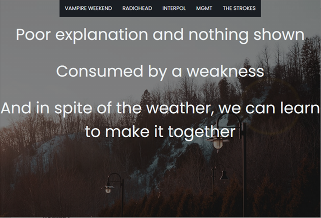
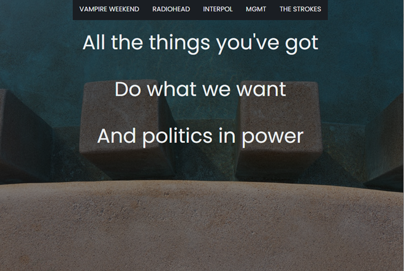

# Fluxus Poetry - A Web Dérive

A fluxus poem web generator using data mining.

## General Info
### Description
[Fluxus poetry](https://examiningtheodd.com/2016/03/28/fluxus-poetry-art/#:~:text=When%20it%20comes%20to%20poetry,aesthetic%2C%20concrete%20poetry%20tends%20to) is a form literary art where the nonsensical is encouraged. The poem is usually comprised of phrases and words that do not necessarily make sense together, as well as accompanying unrelated art. This website imititates this art form in a more modern form, it uses randomly data mined lyrics from arbitrarily picked bands, and searches for images based on a random set of words from these lyrics.

### Data mining sources
[Wikipedia](https://en.wikipedia.org/wiki/Main_Page) - lists of the band's songs

[Genius](https://genius.com/) - lyrics of the selected songs

[Unsplash](https://unsplash.com/) - images using specific keywords

## Technologies
Project developed with:
* Python version: 3.7
* Flask and BeautifulSoup4 Libraries
* Basic CSS and HTML

## Some interesting samples
Using lyrics from Vampire Weekend Songs:

Lyrics from Interpol:

To view a preview on your browser click [here](https://art151-lvicen.herokuapp.com/)

## ToDo
* Highlight keywords randomly picked for image searching
* Allow users to input their own band, or offer randomly selected options

